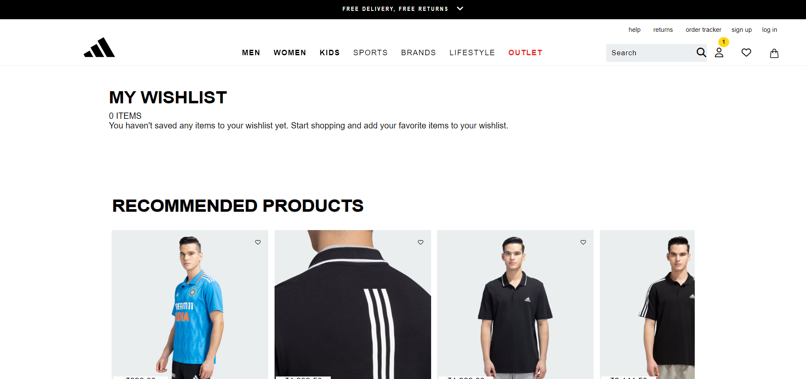

# ADIDAS.Co.in :running:
## Backpack
## Introduction
##### <i>Backpack page ui contains the collection of alluring backpacks with their brand name and the price of each bag.</i>

## Components

### 1. Navigation Bar
Navigation Bar includes the components related to all the webpages. It is a fixed navbar.
### 2. Body page
The body page of this contains the contents related to the products of backpacks and their prices. 
## Men

##### <i>Men page ui contains the content related to the men products like shoes, T-shirts and more.</i>
## Components

### 1. Navigation Bar
Navigation Bar includes the components related to all the webpages.
### 2. Body page
The body page of this contains the images of products related to men with their prices and description of each image. 
### 3. Shop Men button
The shop men button helps users to navigate to the webpages that contains all the men products. 

## Wislist
##### <i>Wishlist page contains the products that are liked by the users </i>

## Components

### 1. Navigation Bar
Navigation Bar includes the components related to all the webpages.
### 2. Body page
The body page of this contains the products that are people is wishing to buy and the recommended products related to their wishlist.
## Outlet
##### <i>Outlet page contains all the deals related to the products</i>

## Components

### 1. Navigation Bar
Navigation Bar includes the components related to all the webpages.
### 2. Body page
The body page of this contains the products that have offers on each product.

# Technologies
All the pages above is created using HTML, CSS and Javascript technologies.
## LEARNINGS
### 1. Understanding User Requirements
- Clearly defined user requirements at the beginning led to a more focused development process;
### 2. Agile Development
- Embracing an agile development approach allowed for flexibility in adapting to changing project needs.
### 3. Collaboration and Communication
- Effective comminication within the tean and regular collaboration meetings improved overall project coordination.
### 4. Technology
- Experimenting with HTML, CSS & Javascript provided valuable insights into its benefits and limitations.
### 5. Problem Solving
- Encountering and solving errors enhanced problem-solving skills among team members.

# CONCLUSION
All the pages above are responsive for all devices and each page is linked to the home page of the website.

