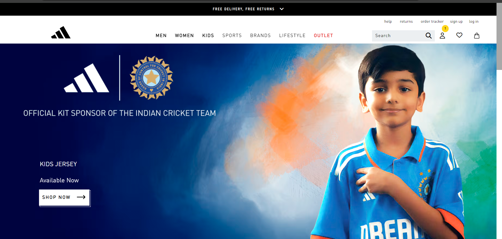
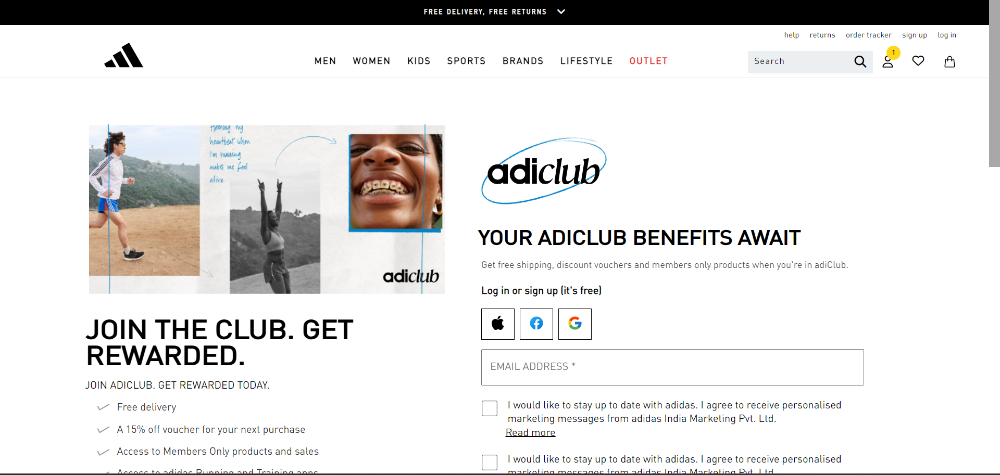

# ADIDAS.Co.in :running:
## Kids page
## Introduction
##### <i>Kids page ui was designed with the products related to kids and users can navigate to different products which are available for kids in the website.</i>

## Components

### 1. Navigation Bar
Navigation Bar includes the components related to all the webpages. It is a fixed navbar.
### 2. Body page
The body page of this contains the contents related to the products of kids. 
### 3. Button
The purpose of the button on the page is to navigate to the pages related to shop for kids. 
## Samba page

##### <i>Samba page ui contains the content related to the products of that particular Samba brand.</i>
## Components

### 1. Navigation Bar
Navigation Bar includes the components related to all the webpages.
### 2. Body page
The body page of this contains the images of products of the Samba brand with their prices and description of each image. 

## Login page
##### <i>Login page is for user authentication to enter a specific website which trespassers cannot see. </i>

## Components

### 1. Navigation Bar
Navigation Bar includes the components related to all the webpages.
### 2. Body page
The body page of this contains fields for the Email and some other browsers link from which you can login with your google accounts.

# Technologies
All the pages above is created using HTML, CSS and Javascript technologies.
## LEARNINGS
### 1. Understanding User Requirements
- Clearly defined user requirements at the beginning led to a more focused development process;
### 2. Agile Development
- Embracing an agile development approach allowed for flexibility in adapting to changing project needs.
### 3. Collaboration and Comminacation
- Effective comminication within the tean and regular collaboration meetings improved overall project coordination.
### 4. Technology
- Experimenting with HTML, CSS & Javascript provided valuable insights into its benefits and limitations.
### 5. Problem Solving
-Encountering and solving errors enhanced problem-solving skills among team members.

# CONCLUSION
All the pages above are responsive for all devices and each page is linked to the home page of the website.