# ADIDAS.Co.in 🏃

## Table of Contents
1. [INTRODUCTION](#introduction)
2. [FEATURES](#features)
3. [TECHNOLOGIES](#technologies)
4. [INSTALLATION](#installation)
5. [CHALLENGES](#challenges)
6. [REFERENCES](#references)
7. [WEBSITE UI](#website-ui)
8. [LICENSE](#license)
9. [CONCLUSION](#conclusion)

## INTRODUCTION 🏅
"Welcome to adidas.co.in, a UI-Based Website 🌐 where design meets functionality. In the dynamic realm of e-commerce, our endeavor focused on elevating the digital presence of the Adidas brand through a comprehensive User Interface (UI) redesign. With a keen eye on blending aesthetics and functionality, our team aimed to create an immersive and user-friendly online platform for sports enthusiasts and fashion aficionados. The project encompassed a spectrum of tasks, ranging from reimagining the website's visual elements to enhancing the overall navigation and user experience. Through thoughtful design choices and seamless integration of interactive features, our goal was to establish a digital gateway that not only showcased Adidas' diverse product range but also provided a delightful and engaging journey for online shoppers. The project's success hinged on harmonizing the essence of the brand with the expectations of a modern, tech-savvy audience, resulting in a UI that resonates with Adidas' legacy while embracing contemporary digital trends."

## PROJECT 🎯
This project was assigned by [Geekster](#) as a Major Project for a team of 8 members 🤹 regarding Front-end web development.
   - ✨ Abhay Panchal (CAPTAIN)
   - ✨ Noel Kujur
   - ✨ Pramadha Yaramakala
   - ✨ Mahima Chauhan
   - ✨ Christy Jubi
   - ✨ Deepak Yadav
   - ✨ Rakesh Latke
   - ✨ Mohd Abid

🎁 It was an exciting opportunity for all of us to apply our skills and collaborate with each other to create a polished website. 🌐

## FEATURES 🛰️
1. **Responsive Design:**
   - The website is responsive to different screen sizes and devices, providing a seamless experience for users on desktops, tablets, and mobile devices.

2. **Navigation Menu:**
   - Implemented an intuitive and well-organized navigation menu to help users easily explore different product categories and sections of the website.

3. **Product Listings:**
   - Displays products with clear images, concise descriptions, and relevant information such as price and brands.

4. **Product Pages:**
   - Individual product pages with detailed information, customer reviews, and related products to enhance the overall shopping experience.

5. **User Accounts:**
   - Provides the option for users to create accounts, allowing them to track orders, save preferences, and streamline the checkout process.

6. **Social Media Integration:**
   - Integrated social media buttons to encourage users to share products and follow the brand on social platforms.

7. **Footer:**
   - A footer containing essential links such as terms and conditions, privacy policy, returns policy, and other relevant information.

## TECHNOLOGIES 💻

1. **HTML:**
   - HTML is a programming language used for structuring web pages, including headers, navigation bars, content sections, and footers.

2. **CSS:**
   - Applied for styling and layout with different CSS properties.

3. **JAVASCRIPT:**
   - JavaScript is a dynamic programming language used for web development, allowing the implementation of dynamic features on web pages.

4. **FONT AWESOME:**
   - Font Awesome is a comprehensive icon library offering a vast selection of icons for various purposes, such as user interface design, web development, and graphic design.

   - **Usage:**
     - **Include the CSS:** Add the Font Awesome CSS stylesheet to your HTML document by including a link in the section.
     - **Add Icons:** Insert icons into your HTML using the element with the appropriate class. Customize their appearance using CSS.
     - **Customize Icons:** Modify icons' size, color, and alignment by adding extra classes and applying CSS styles.
     - **Explore Icons:** Visit the Font Awesome website or documentation to find the icons that suit your project's needs.

5. **GOOGLE FONTS AND ICONS:**
   - Google Fonts is a free and extensive collection of web fonts that allows developers to easily integrate diverse and visually appealing fonts into their websites.

   - Google Icons, typically referenced from the Material Design Icons library, are vector icons that can be easily customized and scaled for use in web and mobile applications.

## INSTALLATION 📲
To get started with this website clone, follow these steps:
1. Install Visual Studio Code for coding.
2. Clone git Repository.
3. Open Project Directory.
4. Open VS Code.
5. Open the project folder.
6. **Start the Application:** Open the `index.html` file in your web browser or use a local development server if you have one configured.
7. The application should now be running locally rendering HTML, CSS, and JavaScript.

## CHALLENGES 🎢
Throughout the development of our project, our team encountered various challenges and obstacles. Here, we document some of the major issues we faced:

1. **COMMUNICATION:**
   - Coordinating tasks, updates, and changes among team members requires effective communication to ensure everyone is on the same page.

2. **CONSISTENCY:**
   - Maintaining consistency in coding styles, naming conventions, and overall structure is crucial.

3. **VERSION CONTROL:**
   - Handling version control with tools like Git helps prevent conflicts and allows for collaboration, but it requires careful management to avoid code conflicts.

4. **BROWSER COMPATIBILITY:**
   - Ensuring the website functions correctly across different browsers can be challenging due to varying levels of support for HTML, CSS, and JavaScript features.

5. **RESPONSIVENESS:**
   - Creating a responsive design that works well on different devices and screen sizes requires careful planning and testing.

6. **TESTING AND DEBUGGING:**
   - Rigorous testing and debugging are necessary to identify and fix issues promptly.

## WEBSITE UI ✈️
### 1. HOME PAGE UI
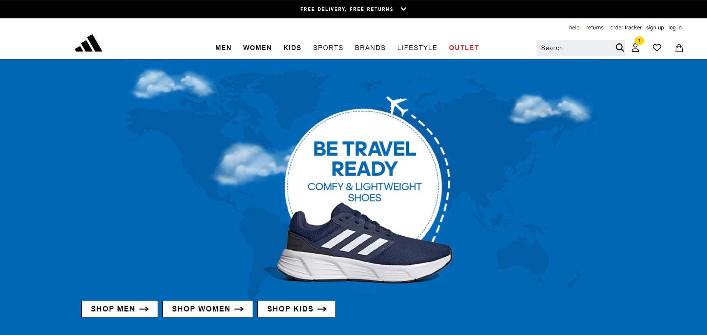
**UI Description:** "The Home section is designed to help users easily access. The UI focuses on user-friendly navigation, allowing users to easily access services."

### 2. NAVBAR
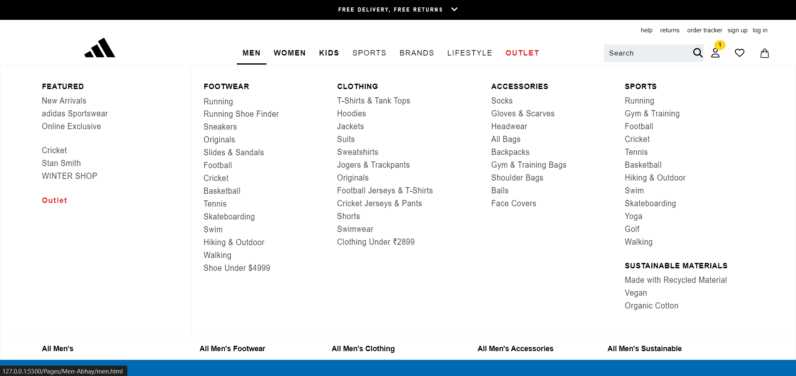
**UI Description:** "The navigation section is designed to help users easily navigate to their required product pages."

### 3. COLLECTIONS
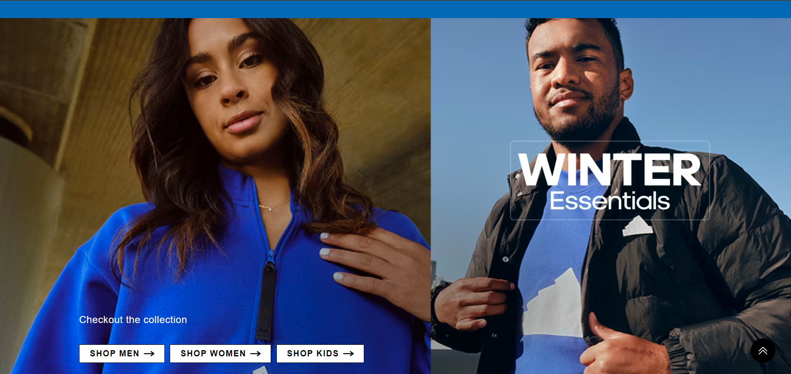
**UI Description:** "The collections section is designed to help users find out what collections are present on the website."

### 4. POPULAR RIGHT NOW
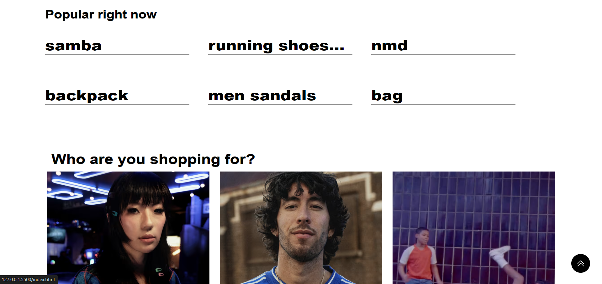
**UI Description:** "The section is designed to help users easily find out what products are going popular."

### 5. NEW ARRIVALS
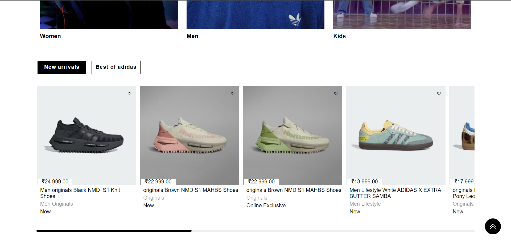
**UI Description:** "The new arrivals section is designed to help users easily know the new collection of Adidas and the best products of Adidas."

### 6. WHAT'S HOT?
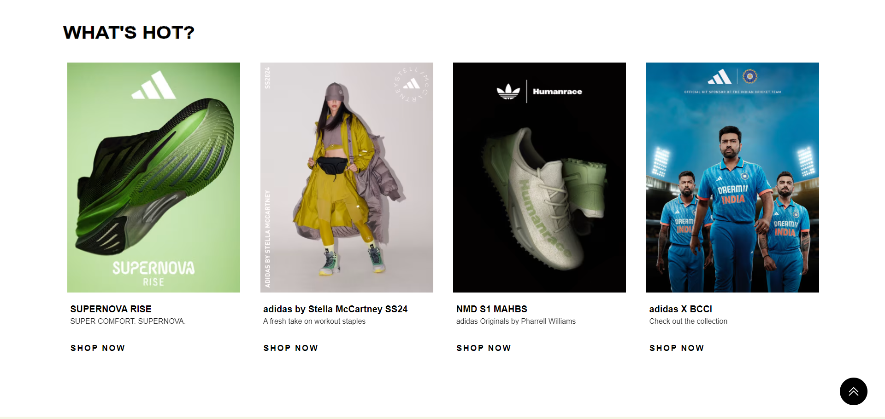
**UI Description:** "The What's hot section is designed to help users easily navigate to the pages of particular brand products."

### 7. NAVBAR PAGES
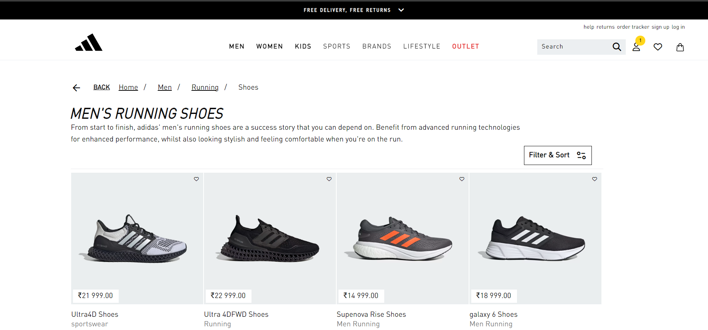
**UI Description:** "The Navbar pages are designed to help users easily navigate to the pages related to particular activity products."

### 8. WHAT'S HOT LINKED PAGES
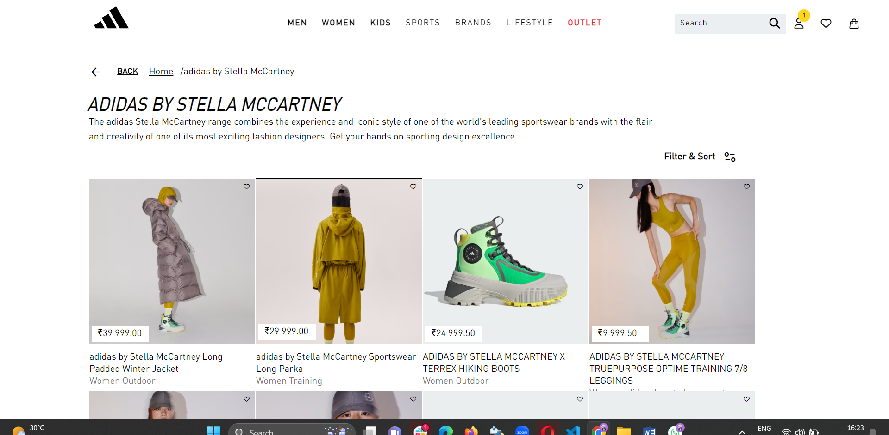
**UI Description:** "The what's hot section is designed to help users easily navigate to the pages linked to them."

### 9. FOOTER
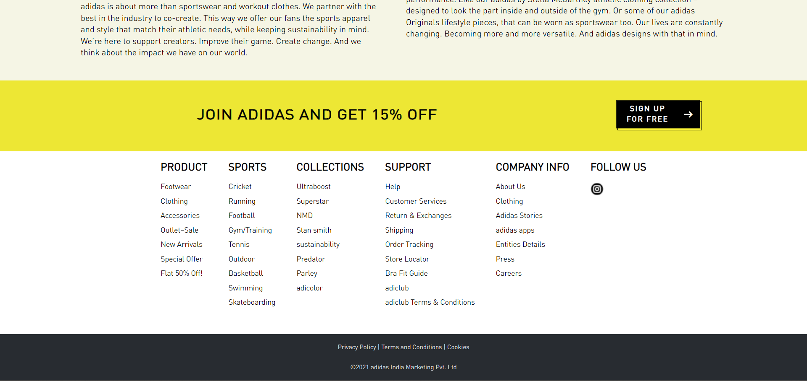
**UI Description:** "The Footer section is designed to help users easily navigate through the pages linked to each section. The UI focuses on user-friendly navigation, allowing users to easily access services."

### 10. POPULAR LINKED
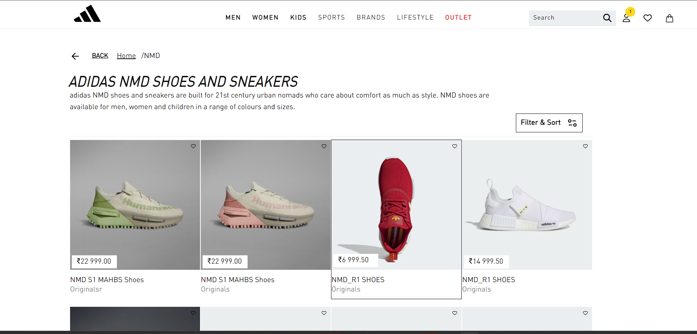
**UI Description:** "The popular linked section is designed to help users easily navigate to the pages linked to it and checkout collection."

### 11. HELP
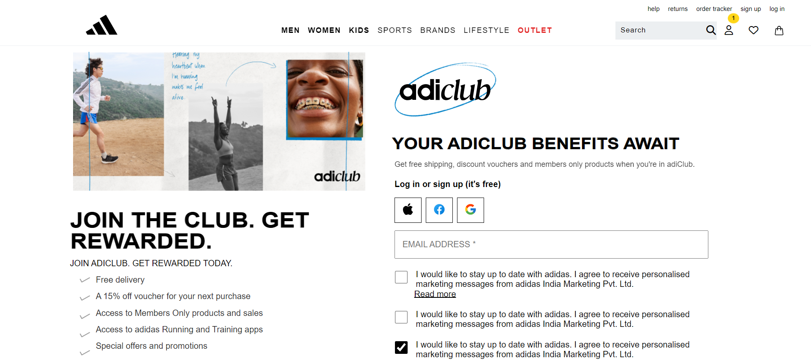
**UI Description:** "The Help page is designed to help users connect with Adidas and communicate with them."

### 12. SIGNUP
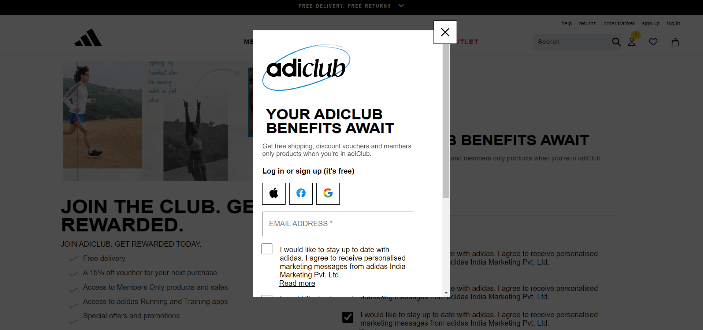
**UI Description:** "The signup is designed to help users get signed in with the Adidas website, and they will be notified whenever any deals are there."

### 13. RESPONSIVE HOMEPAGE
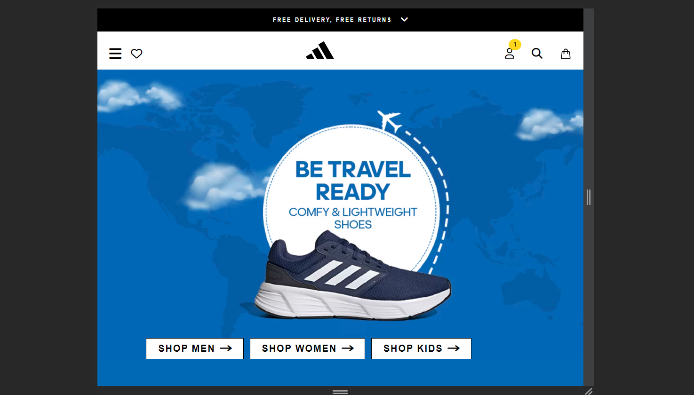
**UI Description:** "This page hides the content in the navbar and displays it as a menu bar."

### 14. MENU BAR
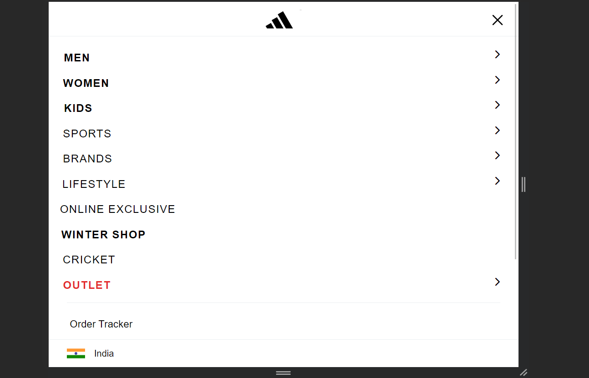
**UI Description:** "This section contains the content of the navbar and will be displayed on smaller screens."

### 15. RESPONSIVE FOOTER
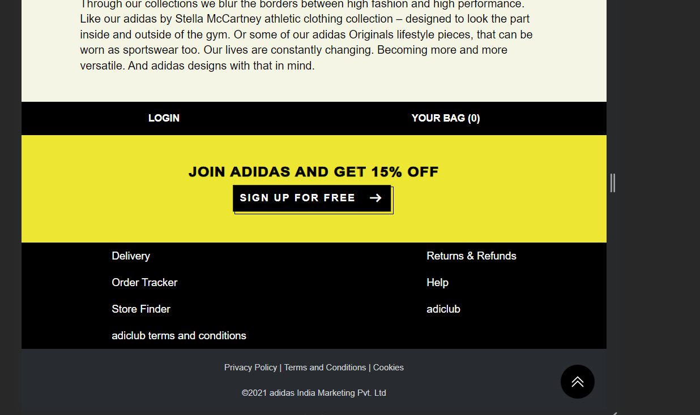
**UI Description:** "This section in the footer will be displayed on smaller screens and hidden on larger screens."

### 16. BACKPACK
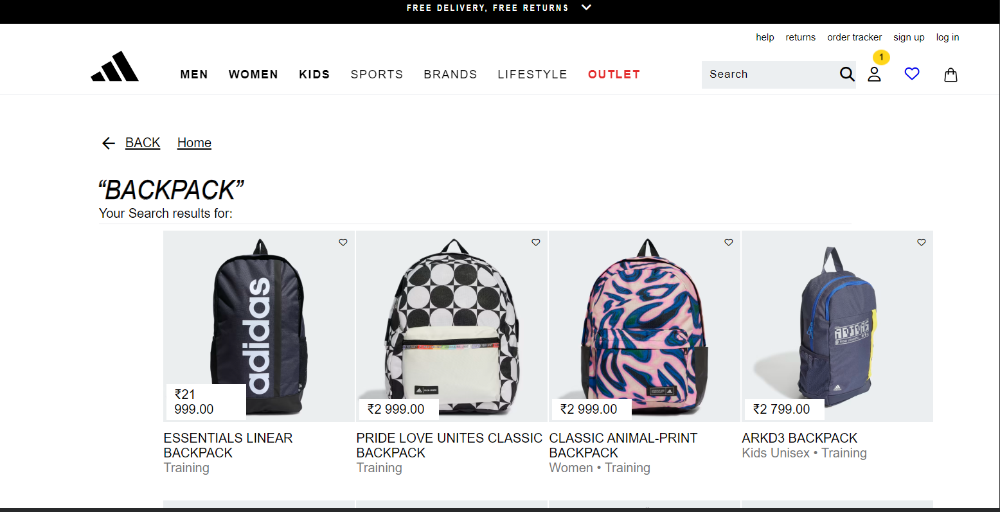
**UI Description:** "Backpack page UI contains the collection of alluring backpacks with their brand name and the price of each bag and footer part which is responsive for all types of screens."

### 17. MEN
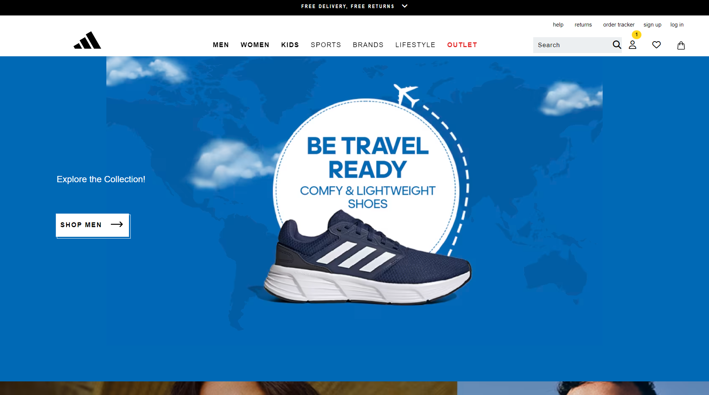
**UI Description:** "Men page UI contains the home page for men and when we click the shop button on it will navigate to the pages related to men products."

### 18. WISHLIST
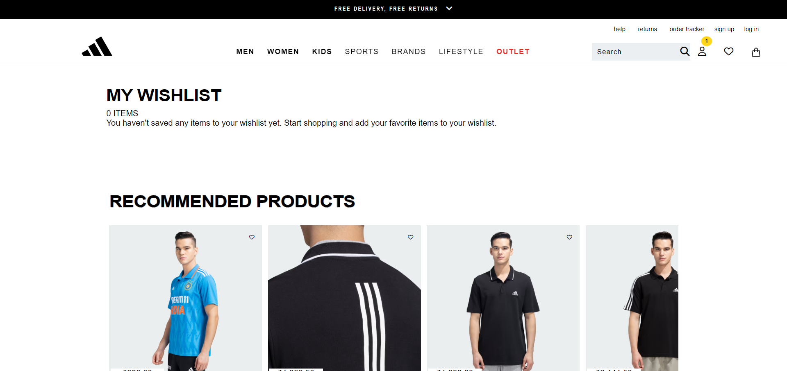
**UI Description:** "Wishlist page contains the images and details of the products that are liked by the users."

### 19. OUTLIST
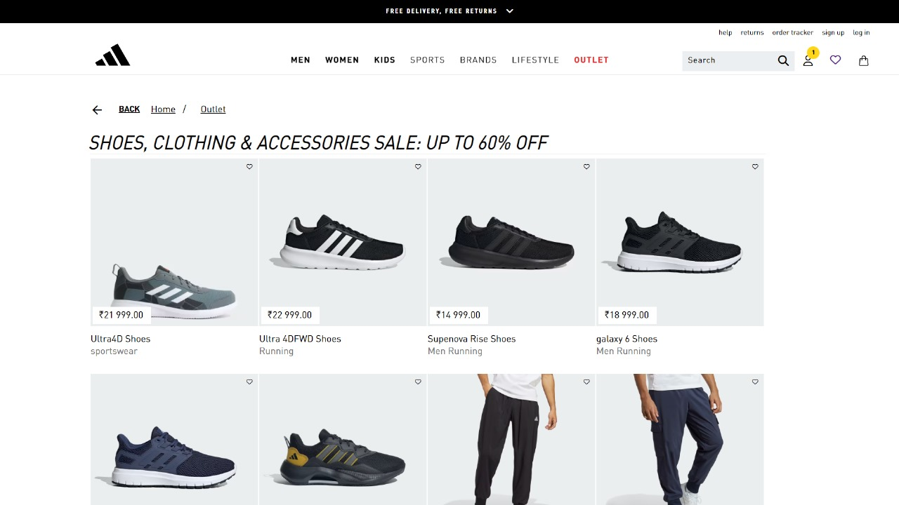
**UI Description:** "Outlet page contains all the deals related to the products."

## REFERENCES 📚
- W3 Schools

## LICENSE 🔗
There is no license for this project as it is created under a major project @Geekster. You are free to use and modify the code based on your requirements.

## CONCLUSION ⌛
In the process of recreating the user interface (UI) of the ADIDAS website, we've aimed to capture the visual effects as a reference. Our project encompasses various sections, including products such as shoes, cricket jerseys, bags, backpacks, and more for men, women, and kids.

**Achievements:**
- **Faithful Representation:** We have strived to provide a faithful representation of the Adidas website, mirroring its visual aesthetics, layout, and key functionalities.
- **Learning and Skill Development:** This project has been a valuable learning experience in web development. We've honed our skills in HTML, CSS, and JavaScript, allowing us to create responsive and visually appealing web pages.
